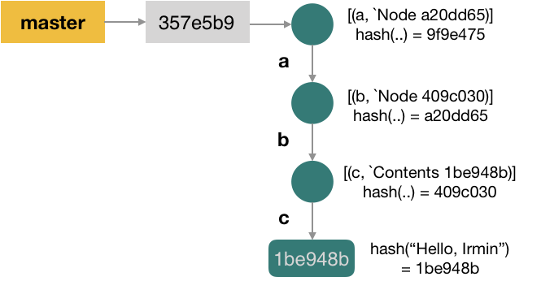
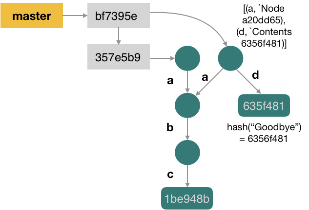

Two types of stores are used in Irmin: the **block** and the **reference**
store.

### The block store

This is the type of store used for the _commits_, _nodes_ and _contents_. The
block store is **persistent** and **content addressable**. **Persistence** means
that updating a data structure returns a new one, which shares its sub-parts as
much as possible with the original structure, to avoid the cost of extra
allocations. A side effect is that a history of updates is maintained as well.

It is also a **content addressable** store as _values_ (be it contents, commits
or nodes) are stored as a pair `(hash(value), value)` and therefore a value can
be accessed using its hash.

### The reference store

It is a mutable store, used for _branches_. As in Git, branches are tags added
to commits. A default branch is always available in Irmin, the `master`.
Branches are useful when multiple processes access the store, to keep track of
the state of each process. This type of store is also called an **atomic write**
store: two independent processes can do some local modifications, but updating
the same branch is an atomic and concurrent operation.

Branches are stored in the reference store as pairs of `(hash(commit), branch)`.

### Combining the two

Commits, nodes, contents and branches stores combine in an Irmin store.

As we have seen in our examples so far, Irmin uses trees to store its contents:
the leaves of the tree contain the _contents_, while the _nodes_ encode the path
in the tree from the root to the contents. _Commits_ are represented as special
nodes in the tree. For instance, the contents we commited to a `Mem_store` in
the [Getting started](/tutorial/getting-started) section:

```ocaml
Store.Repo.v config >>= Store.master >>= fun t ->
Mem_store.set_exn t ["a"; "b"; "c"] "Hello, Irmin!" ~info:(info "my first commit")
```

are represented as 

We add a new commit:

```ocaml
Mem_store.set_exn t ["d"] "Goodbye!" ~info:(info "my second commit")
```

and the store changes to



The `master` branch references the latest commit.

Irmin has a few _types_ of stores available: the in-memory store and the git
store that we have seen in section [Getting started](/tutorial/getting-started),
but also some other that you can explore on
[github](https://github.com/mirage/irmin/tree/master/src). You can also create
your own type of store, as we will see in the next section.
